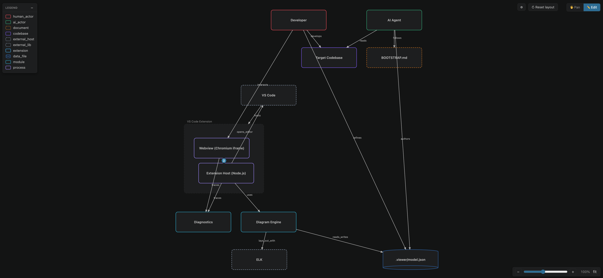

*Project Little Oxford helps you and an AI coding agent build a shared understanding of a codebase or system using a diagram. The agent writes a loose `.viewer/model.json`; the VS Code extension renders it as an interactive diagram; you drag, inspect, and refine the system model as you go.*

This project is a VS Code Extension with tooling to create flexible diagrams describing a codebase or system:

- **Model & schema** — a loose JSON format for components, relationships, and styling rules
- **Diagram renderer** — ELK-based layout with drag-to-pin and click-to-jump-to-source
- **VS Code extension** — renders `.viewer/model.json` 
- **Bootstrap** — agent instructions ([`BOOTSTRAP.md`](BOOTSTRAP.md)) for reading a codebase and producing the model

If you are an AI or coding agent reading this, take a look at BOOTSTRAP.md as a starting point in how to use this project. 

If you are a human, you can either use your agent in a conversation loop to create/edit the diagram or write the model by hand.

## Screenshots


*System diragm for this project, generated in conversation with Claude Code*

## Motivation

Coding agents already have native tools for reading, writing, and searching code. Give them a loose, generic schema to describe what they find, let them capture as much as they can, and let the renderer be specific about what it shows. 

The combination of the model and the diagram is a shared understanding between agent and human of the system.

Every developer's mental model of the same system looks a bit different. This project should give you the tooling to create a diagram to help you understand your system. 

The ideal worflow is collaborative: the agent builds its understanding, you reshape the diagram, and that pushes back into the model which can be read and used by the agent. 

These ideas are taken with changes from [Andrej Karpathy's LLM Wiki ideas](https://gist.github.com/karpathy/442a6bf555914893e9891c11519de94f).

## Install

> Not on the VS Code Marketplace yet. Install locally from source with `npm install && npm run install:local`.

```
npm install
npm run install:local
```

Reload VS Code (`Ctrl/Cmd+Shift+P → "Developer: Reload Window"`).

After editing source:

```
npm run install:local
```

…then reload again.

Requires `code` on your PATH. If it isn't: `Shell Command: Install 'code' command in PATH` from the command palette.

To uninstall:

```
npm run uninstall:local
```

> Manual steps if you prefer:
>
> ```
> npm run build
> npx vsce package --out project-viewer.vsix
> code --install-extension ./project-viewer.vsix --force
> ```

## Model

`.viewer/model.json` in any workspace:

```json
{
  "components": {
    "web":  { "kind": "service", "label": "Web App", "parent": null,
              "anchors": [{ "type": "file", "value": "apps/web/src/main.ts" }] },
    "api":  { "kind": "service", "label": "API",     "parent": null },
    "db":   { "kind": "storage", "label": "Postgres", "parent": null }
  },
  "relationships": {
    "w_to_a": { "kind": "http_sync",     "from": "web", "to": "api" },
    "a_to_d": { "kind": "db_connection", "from": "api", "to": "db" }
  },
  "rules": {
    "component_styles": {
      "service": { "symbol": "rectangle", "color": "#38bdf8" },
      "storage": { "symbol": "cylinder",  "color": "#2b6cb0" }
    },
    "relationship_styles": {
      "http_sync":     { "color": "#64748b" },
      "db_connection": { "color": "#2f855a" }
    }
  }
}
```

`Project Viewer: Show Diagram` from the command palette. 

## Debug (F5)

VS Code won't open the same folder in two windows. Use a second clone:

```
git clone https://github.com/marcusraty/project-little-oxford.git ~/code/project-little-oxford-debug
```

1. Open this repo in your source window.
2. F5. Extension Development Host opens.
3. In the dev host: File → Open Folder → `~/code/project-little-oxford-debug`.

Save in source, `Ctrl/Cmd+R` in dev host to reload. esbuild rebuilds via the `preLaunchTask`.

> Dev host loads extension code from source folder (`--extensionDevelopmentPath`) and workspace data from the debug clone. `git pull` the debug clone occasionally.

## Roadmap

Some things I'm thinking about and wanting to work on:

- Multi-level diagrams (explode a component into its internals)
- PR diffs at the architecture level
- Different views on the same model (security, deployment, data flow)
- Test coverage overlays

If any of these matter to you, start a discussion.

## Contributing

Early days for this project, and not actively seeking contributors yet. If there is an idea or isue you have please start a discussion or contact me.

## License

MIT