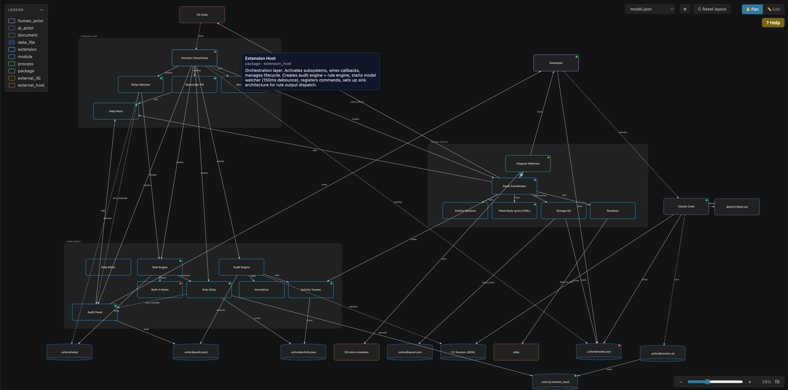
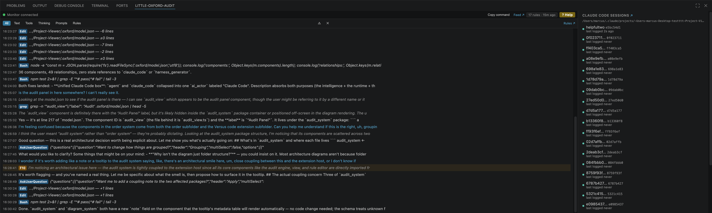

# Project Little Oxford

> Tools for agentic engineering that help you feel superhuman.


Project Little Oxford helps you and an AI coding agent build a shared understanding of a codebase or system using a diagram. The agent writes a loose .viewer/model.json; the VS Code extension renders it as an interactive diagram; you drag, inspect, and refine the system model as you go. 

The audit system watches your AI coding agent's transcript while it works, and runs a rule engine over the agent's text, thinking, and tool use — surfacing shortcuts, unverified claims, and missing tests as they happen.

If you are an AI or coding agent reading this, take a look at BOOTSTRAP.md as a starting point in how to use this project.

If you are a human, you can either use your agent in a conversation loop to create/edit the diagram or write the model by hand.

## Motivation

Coding agents already have native tools for reading, writing, and searching code. Give them a loose, generic schema to describe what they find, let them capture as much as they can, and let the renderer be specific about what it shows. 

The combination of the model and the diagram is a shared understanding between agent and human of the system. Every developer's mental model of the same system looks a bit different. This project should give you the tooling to create a diagram to help you understand your system. 

The ideal worflow is collaborative: the agent builds its understanding, you reshape the diagram, and that pushes back into the model which can be read and used by the agent. 

These ideas are taken with changes from [Andrej Karpathy's LLM Wiki ideas](https://gist.github.com/karpathy/442a6bf555914893e9891c11519de94f).

## Project feature: Diagram


*System diagram for this project, generated in conversation with Claude Code.*

A live SVG diagram rendered from `.oxford/*.json`. Components and relationships are described in JSON; ELK lays them out; the panel renders live.

- **Drag-to-pin** — drag any component (including nested children with parent-relative coords) to reposition; pins persist in `.oxford/layout.json`.
- **Click-to-jump-to-source** via `anchors` on each component.
- **Activity dots** — red/green per component reflect whether the agent has read the backing file since the model was last updated.
- **Pan / zoom / model picker** for workspaces with more than one diagram.
- **Reset layout**, **draggable legend**, hover tooltips with "Last read X ago" and staleness state.
- **Help button** (top-right) opens a quick-pick: email maintainer or start a GitHub discussion.

Authored by your agent following [`BOOTSTRAP.md`](BOOTSTRAP.md), or by hand. Schema is intentionally loose — `kind` is any string, no `additionalProperties: false`, unknown fields preserved on round-trip.

## Audit rules



>**Note:** Audit available for Claude Code harness only

Rules live in `.oxford/rules/` as JSON. Default rules ship with the extension; edits to any `.oxford/rules/*.json` file are picked up automatically by a file watcher — no command, no reload.

Each rule defines:
- `kinds` — which event types it matches (`text`, `thinking`, `tool_use`, `user_prompt`)
- `pattern` — regex against the event content
- `action` — `notify`, `monitor`, `hook`, `log`
- `severity` — `info`, `warning`, `error`

**Behavioral rules** match text/thinking. F4 catches shortcut language ("just wire", "easy path"), F9 catches "manual testing only", F11 catches "skip the test"/"add tests later".

**Companion rules** detect missing co-edits — e.g. C2 "edited `render.ts` without touching `render.test.ts`".

Schema lives at [`schemas/audit-rule.schema.json`](schemas/audit-rule.schema.json), and `.oxford/rules/*.json` files open in a guided form-view rule editor.

When a rule fires, the result fans out to four sinks:
- **Monitor feed** (`.oxford/.monitor_feed`) — stream into your agent's terminal so they see violations in real time. Each line is tagged with event kind, e.g. `[F11] (thinking) ...` or `[F4] (tool_use:Edit) ...`.
- **Audit panel** — webview with filters, badges, and a live rules-status chip showing when rules were last reloaded.
- **Status bar** — warning + error counters on the little-oxford pill.
- **Activity** — feeds the staleness dots on the diagram.

## Install

Not on the VS Code Marketplace yet. Grab the `.vsix` from the latest [release](https://github.com/marcusraty/project-little-oxford/releases) (or build it yourself — see [Develop](#develop)).

Install it in VS Code:

- **GUI:** `Cmd/Ctrl+Shift+P` → **"Extensions: Install from VSIX..."** → select the file
- **CLI:** `code --install-extension little-oxford.vsix`

Then reload: `Cmd/Ctrl+Shift+P` → **"Developer: Reload Window"**.

To uninstall: VS Code Extensions panel → little-oxford → Uninstall.

## Get started

In any workspace with code you want to diagram:

### Diagram

1. Have your AI coding agent follow [`BOOTSTRAP.md`](BOOTSTRAP.md) — it'll author `.oxford/model.json`. Or run **`little-oxford: Create Starter Diagram`** from the command palette and edit by hand.
2. Open the diagram panel: **`little-oxford: Show Diagram`**.

To **edit or import audit rules later**, click the ⚙ button in the top-right of the diagram — VS Code settings opens with links straight to the behavioral / companion rule files and the import command.

### Audit

> **Claude Code only.** The audit pipeline normalises Claude Code JSONL transcripts. Other agents aren't supported yet.

1. Open the **little-oxford audit panel** (bottom panel in VS Code).
2. Click **Copy command** in the monitor-status row at the top of the panel — it copies agent-facing instructions to your clipboard.
3. Paste into your Claude Code chat. The agent attaches the Monitor tool to `.oxford/monitor.sh` and starts streaming rule matches; the audit panel mirrors the same events with badges and filters.

> **About the monitor and your LLM bill.** Step 3 attaches your agent to a live event stream — every audit rule match arrives as a notification in your conversation. That uses your context window faster and consumes your LLM subscription's per-message quota more than a normal session. Worth it during active development when behavioural signals matter; stop the monitor (kill the background process or detach the Monitor task) when you're done.

## Develop

Build from source — clones the repo, installs deps, packages a `.vsix`, and installs it into your VS Code:

```
git clone https://github.com/marcusraty/project-little-oxford.git
cd little-oxford
npm install
npm run install:local     # build → npm run package → code --install-extension
```

Reload VS Code after `install:local`. Requires `code` on your PATH — `Cmd/Ctrl+Shift+P` → **"Shell Command: Install 'code' command in PATH"** if it isn't. To uninstall: `npm run uninstall:local`.

If you just want the `.vsix` artifact without installing it (e.g. to publish on a release), run `npm run package` — output lands at `little-oxford.vsix` in the repo root.

Test suites:

```
npm test                  # Node unit suite
npm run test:e2e          # Playwright webview tests (rendered diagram + audit panel in Chromium)
npm run test:vscode       # VS Code integration tests (real extension host)
npm run typecheck
```

**Debug (F5):** VS Code won't open the same folder in two windows, so use a second clone as a debug workspace.

```
git clone https://github.com/marcusraty/project-little-oxford.git ~/code/little-oxford-debug
```

1. Open this repo in your source window.
2. Press F5. An Extension Development Host opens.
3. In that host: **File → Open Folder → `~/code/little-oxford-debug`**.

Edit source, hit `Cmd/Ctrl+R` in the dev host to reload. esbuild rebuilds via the `preLaunchTask`.

## Model

`.oxford/model.json`:

```json
{
  "components": {
    "web":  { "kind": "service", "label": "Web App", "parent": null,
              "anchors": [{ "type": "file", "value": "apps/web/src/main.ts" }] },
    "api":  { "kind": "service", "label": "API",     "parent": null },
    "db":   { "kind": "storage", "label": "Postgres", "parent": null }
  },
  "relationships": {
    "w_to_a": { "kind": "http_sync",     "from": "web", "to": "api" },
    "a_to_d": { "kind": "db_connection", "from": "api", "to": "db" }
  },
  "rules": {
    "component_styles": {
      "service": { "symbol": "rectangle", "color": "#38bdf8" },
      "storage": { "symbol": "cylinder",  "color": "#2b6cb0" }
    },
    "relationship_styles": {
      "http_sync":     { "color": "#64748b" },
      "db_connection": { "color": "#2f855a" }
    }
  }
}
```

Schema is intentionally loose: `kind` is any string, no `additionalProperties: false`, unknown fields are preserved on round-trip. See [`BOOTSTRAP.md`](BOOTSTRAP.md) for the full spec.

## Known limitations

**Windows Support.** .oxford/monitor.sh is a bash script. Mac and Linux run it natively. Windows users need WSL, Git Bash, or Cygwin — Powershell and cmd won't execute it. The rest of the extension works on Windows; only this optional convenience does not.


**Team workflows / branch switches.** `.oxford/activity.json` (tracks when each component's backing file was last read/edited) and `.oxford/layout.json` (pinned component positions) are committed to git so the diagram is consistent for everyone who clones, but they're mutated by the extension as you and your agent work. Two developers touching the same workspace will produce **git merge conflicts** on these files. Conflicts usually auto-resolve when devs touch different components, but simultaneous edits to the same component need manual resolution. If conflicts become painful for your team, gitignore both files — the diagram still works, you just lose cross-developer continuity of staleness state and pinned positions.

**Audit log persistence.** `.oxford/audit.jsonl` is per-developer (gitignored) but unbounded — it grows in long-running workspaces with no rotation. Delete it manually when it gets large; the extension rebuilds from active Claude Code transcripts on reload.

**No unified coverage report.** The three test suites are run by separate tools that don't share a coverage format — c8 (`npm test`), Playwright in Chromium (`npm run test:e2e`), and `@vscode/test-electron` (`npm run test:vscode`). Files that `import vscode` are invisible to c8 because they can't load outside a VS Code host. A real coverage figure would need V8 coverage from Playwright + a c8 wrapper around the integration runner + merged report. Not in v0.2 — for now, the only honest signal is "do all three suites pass?"

**Single workspace root.** The extension activates per VS Code window and only watches the first workspace root. Multi-root workspaces fall back to that root.

## Roadmap

Loose ideas, no timelines:

- Multi-level diagrams (explode a component into its internals)
- PR diffs at the architecture level
- Different views on the same model (security, deployment, data flow)
- Test coverage overlays

## Contributing

Early days — not actively seeking contributors yet. If you have an idea or issue, please start a discussion or get in touch.

## License

MIT
